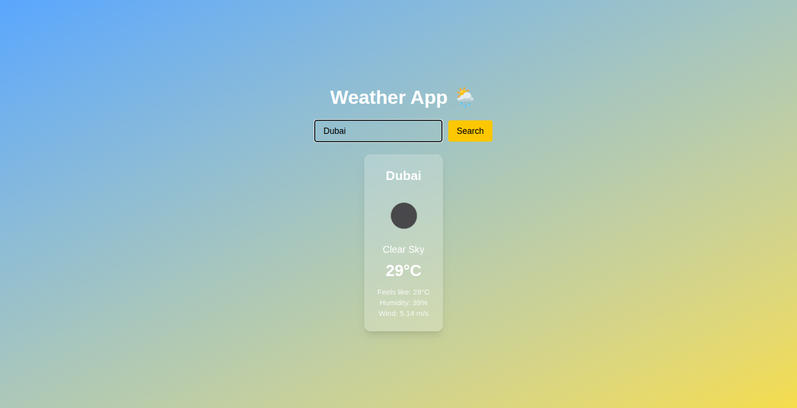

# 🌦️ Next.js Weather App

A clean, minimalistic weather forecast application built with **Next.js**, **Tailwind CSS**, and the **OpenWeatherMap API**.  
It allows users to search for any city and instantly view current weather conditions such as temperature, humidity, and wind speed — with smooth dynamic backgrounds that change based on the weather type.



## ✨ Features

- 🔍 **City-based Search** – Fetch live weather data by city name.  
- ☁️ **Dynamic Backgrounds** – Background color changes according to the weather (e.g., clear sky ☀️, rain 🌧️, snow ❄️).  
- 🌡️ **Real-time Data** – Shows temperature, “feels like”, humidity, and wind speed.  
- 🖼️ **Weather Icons** – Uses official OpenWeatherMap icons for accurate condition visuals.  
- ⚡ **Responsive Design** – Looks great on both desktop and mobile.  
- 🔑 **Secure API Key Handling** – API key stored in `.env.local`.

---

## 🧠 Tech Stack

- **Next.js 14+** – For app routing and server-side rendering  
- **Tailwind CSS** – For modern, responsive UI  
- **OpenWeatherMap API** – For live weather data  

---

## 🚀 Installation & Setup

Clone this repository:
```bash

git clone https://github.com/YOUR_USERNAME/weather-app.git

cd weather-app

```

Install dependencies:

```
npm install
```

Create a .env.local file in the root folder and add your API key:
```
NEXT_PUBLIC_WEATHER_API_KEY=your_openweathermap_api_key
```

Run the development server:
```
npm run dev
```

Then open http://localhost:3000
 in your browser 🎉
